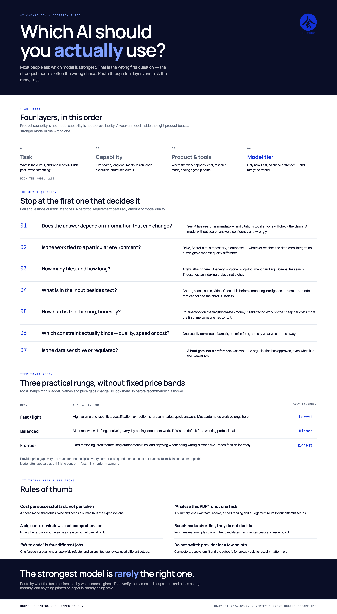

# Which AI Model Should I Use?

A free, installable skill that helps non-technical people decide **which AI product,
mode and model to use for a specific task** — plus an infographic and a short deck you
can use to teach it.

Works in Claude, Claude Code, Codex, and anything else that reads the
[Agent Skills](https://agentskills.io) `SKILL.md` format.

<p align="center">
  
</p>

---

## Why this exists

Plenty of tools route API traffic between models — RouteLLM, LiteLLM, Bifrost,
OpenRouter, Not Diamond. They all answer the same engineering question: *which model
should this API call go to?*

Almost nothing answers the question an ordinary person actually has:

> "I need to do **this**. Which app do I open, which mode do I switch on, and does it
> matter which model I pick?"

That is a different question, and the answer is usually not "the strongest model."

## The idea

Route through four layers and pick the model **last**:

```
Task  →  Capability needed  →  Product / tool needed  →  Model tier
```

> Product capability ≠ model capability ≠ tool availability.

A weaker model inside the right product beats a stronger model in the wrong one. A task
about your own documents is decided by which product can reach those documents, not by
benchmark rank.

## The one rule the skill follows

**It never names a model from memory. It searches first.**

Model lineups, tier names and prices change every few weeks. A skill with a hardcoded
recommendation table would be wrong within a month of shipping, and confidently so. This
one encodes the *reasoning*, which is durable, and looks up the *names*, which are not.

There is a dated snapshot in `references/snapshot.md` for offline use — and it is
labelled stale by design.

---

## Install

### Claude (web, desktop, mobile)

1. Download [`dist/which-ai-model.zip`](dist/which-ai-model.zip).
2. Turn on **Settings → Capabilities → Code execution and file creation** (the Skills
   menu does not appear until this is on).
3. Go to **Customize → Skills → + → Create skill** and upload the zip.
4. Toggle the skill on.

### Claude Code

```bash
# personal, available in every project
mkdir -p ~/.claude/skills
cp -R skills/which-ai-model ~/.claude/skills/

# or scoped to one project
mkdir -p .claude/skills
cp -R skills/which-ai-model .claude/skills/
```

### Codex

```bash
CODEX_HOME="${CODEX_HOME:-$HOME/.codex}"
mkdir -p "$CODEX_HOME/skills"
cp -R skills/which-ai-model "$CODEX_HOME/skills/which-ai-model"
```

Restart Codex so it picks up the new skill. Or from inside Codex:

```
$skill-installer install https://github.com/houseofichigo/skill-resources/tree/main/skills/which-ai-model
```

### Anything else that reads SKILL.md

Copy `skills/which-ai-model/` into that agent's skills directory — Cursor, Gemini CLI,
and others follow the same convention.

---

## Using it

Just ask in plain language. The skill triggers on questions like:

- "Which model should I use to summarise 40 client transcripts a week?"
- "Is ChatGPT or Claude better for going through a 300-page contract?"
- "Am I overpaying by running everything on the most expensive model?"
- "Why is my AI so bad at reading my spreadsheets?"
- "We're standardising AI across the team — which subscriptions do we need?"

You get back a recommendation, the one constraint that drove it, a cheaper fallback,
and what would change the answer. Not a comparison matrix to interpret yourself.

---

## What's in the repo

```
SKILL.md                        the skill itself
references/
  decision-tree.md              the full tree, with the branches SKILL.md compresses
  capability-map.md             common tasks → capability and tooling actually required
  snapshot.md                   dated lineup snapshot — stale by design, verify by search
  sources.md                    where to look up current lineups, and how to read a benchmark

infographic/
  which-ai-model.png            the poster above — print it, put it on a wall
  which-ai-model.html           source, if you want to edit or re-render it

presentation/
  which-ai-model-explained.pptx editable, for trainers
  which-ai-model-explained.pdf  read-only, opens anywhere
  build_deck.js                 regenerates the deck

dist/
  which-ai-model.zip            ready to upload to Claude

package.json                    pinned artifact-build dependencies and commands
package-lock.json               reproducible npm dependency resolution
THIRD_PARTY_NOTICES.md          bundled font notices
SECURITY.md                     security reporting and build-dependency scope
```

---

## The decision tree, in short

1. **Does the answer depend on information that can change?** → live search is
   mandatory, and citations if anyone will check the claims.
2. **Is the work tied to a particular environment?** → Drive, SharePoint, a repository,
   a database. Whatever reaches the data wins.
3. **How many files, and how long?** → a few: attach them. Thousands: that is an
   indexing project, not a chat.
4. **What is in the input besides text?** → charts, scans, audio, video narrow the pool
   before intelligence does.
5. **How hard is the thinking, honestly?** → routine work on the flagship wastes money;
   client-facing work on the cheap tier costs more when someone has to fix it.
6. **Which constraint binds — quality, speed or cost?** → one usually dominates.
7. **Is the data sensitive or regulated?** → a hard gate. Use what your organisation
   approved, even when it is the weaker tool.

Stop at the first one that decides it. Earlier questions outrank later ones.

## Three practical rungs

Most provider lineups can be understood as the same practical ladder:

| Rung | For | Cost tendency |
|---|---|---|
| Fast / light | High volume, repetitive: classification, extraction, short summaries | Lowest |
| Balanced | Most real work: drafting, analysis, everyday coding, documents | Higher |
| Frontier | Hard reasoning, architecture, long autonomous runs | Highest |

Teach the ladder. Look up current names and pricing. Price gaps vary by provider,
so compare cost per successful task rather than relying on a fixed multiplier.

## Rebuild the artifacts

Requirements: Node.js 20 or newer, Chromium for Playwright, LibreOffice, and the
standard `unzip`, `zip` and `perl` command-line tools.

```bash
npm ci
npx playwright install chromium
npm run build
```

`npm run build` regenerates the PPTX, infographic PNG, PDF and installable skill ZIP from their checked-in
sources. The editable PPTX retains Manrope, Inter Tight and JetBrains Mono. Because
LibreOffice does not load the WOFF2 webfont files, the PDF-only export uses its bundled
Rubik, Noto Sans and DejaVu Sans Mono fallbacks to prevent serif substitution. Set
`SOFFICE_BIN` if LibreOffice's `soffice` command is not on your path. Rebuild
`dist/which-ai-model.zip` is rebuilt automatically from `SKILL.md` and `references/`.

The deck generator uses only its checked-in text and layout constants. It does
not accept user-supplied images. See [`SECURITY.md`](SECURITY.md) for the scoped
`image-size` build-dependency advisory and upgrade policy.

The repository includes third-party font notices in
[`THIRD_PARTY_NOTICES.md`](THIRD_PARTY_NOTICES.md).

---

## Contributing

Corrections and additions welcome, particularly:

- tasks the capability map gets wrong or misses
- decision-tree branches that fail on a real case
- other agents' install paths, once they support `SKILL.md`

Please **don't** send pull requests that hardcode current model names deeper into the
skill. That is the failure mode this is built to avoid.

## Prior art

Worth knowing about — these solve the programmatic routing problem rather than the human
one:

- [RouteLLM](https://github.com/lm-sys/RouteLLM) — learns strong-vs-weak routing
- [LiteLLM](https://github.com/BerriAI/litellm) — gateway with fallbacks and load balancing
- [vLLM Semantic Router](https://github.com/vllm-project/semantic-router) — policy-based routing
- [awesome-ai-model-routing](https://github.com/Not-Diamond/awesome-ai-model-routing) — a curated map of the field

## Licence

[MIT](LICENSE). Use it, fork it, teach with it, rebrand it.

---

Built by [House of Ichigo](https://houseofichigo.com) — AI training and advisory.
*Equipped to run.*
